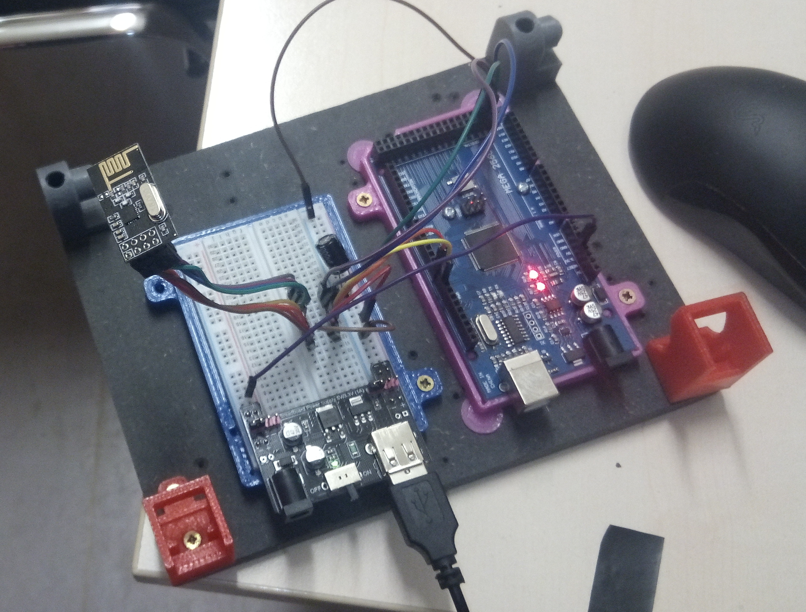

++++++++++++++++++++++++++++++++
Advanced stuf for robot Junior
++++++++++++++++++++++++++++++++

======================================
Suiveur de ligne
======================================

3 capteurs IR de chaque côté

Ajout d'un connecteur 8 points.

+-------+------------+-------------+
| Pin   | Signal     | Arduino pin |
+=======+============+=============+
| 1     | GND        |   -         |
+-------+------------+-------------+
| 2     | D EXT      |   6         |
+-------+------------+-------------+
| 3     | D MID      |   8         |
+-------+------------+-------------+
| 4     | D INT      |   10        |
+-------+------------+-------------+
| 5     | G INT      |   14        |
+-------+------------+-------------+
| 6     | G MID      |   16        |
+-------+------------+-------------+
| 7     | G EXT      |   18        |
+-------+------------+-------------+
| 8     | P5V        |   -         |
+-------+------------+-------------+

Résultats
======================================

Enregistrement avec station sol NRF24L01

   
   Station sol NRF24
   
Test du 23/11/2019 à 18:52 
 - VBAT 6.9V à 7.4V
 - vitesse : 90
 - Durée du test : 072725 au chrono manuel 1:11:53
 - les 4 points; 08:80, 24:68, 47:97, 1:03:21 (En ms 8800, 24680, 47970, 63210, 71530).

Essais de vitesse : 7.0V 120 ok putty_tx_191123_2131

Remplacement des batterie 
7.8V(ie 8.4V à vide) KO pour 120
7.7 90 OK putty_tx_191123_2316.log en 57s
7.7V vitesse 110 ok 46s putty_tx_191124_0000.log

Temps de cycle à 10ms putty_tx_191124_0008.log
TC 10ms V 110 BAT 7.7V putty_tx_191124_0017.log US actif refresh every 10ms

Mesure de vitesse
======================================

Sur une ligne droite de 3m parcours en 7s (vitesse dans le code : 110, tension bat-moyenne: 7.45V)
3/7 m/s soit 42.85cm/s = 1.54km/h
Diam roue = 65mm Périmètre = 204mm on tourne à 2.1 tr/s soit environ 126tr/min
Mesure au tachymetre à vide : 171 RPM

Même essai à 90 (7.42V pour 7.87V à vide) : 3m en 9.4s
à 70 : 3m en 16.7s

Avec batterie full : 13.5s
avec 90 8.43s fichier non conservé
avec 110 6.5s Vbat_moy : 7.65V - en charge - mesurées à 8.18V à vide  fichier : putty_tx_191126_2317_3m_110_full.log

V=200 4.6s, VBAT 7.5V

Le reste des résultats est consigné dans le fichier Excel : speeds.xlsx

======================================
Télémètrie / RF transmissions
======================================

Besoin  débit 
======================================
Exemple:

On part sur 32 octets soit 320bits en moins de 1ms à transmettre

1 bits (1/320)ms = 3.215 10-6 environ 312kbits/s

Trame: (séparateur ,)

Sensor gauche (1c),Sensor droit (1c),Vbat(3c),reserve (3c) soit 11 octets

Exemple:

4,0,3.2,0.0

11 octets trasmis en 1ms (max)

10-3/110 = 9us/bits soit 110kbits/s

Choix du module RF 
======================================

Très bonne vidéo youtube:  `Electronoobs`_

.. _`Electronoobs` : https://www.youtube.com/watch?v=vxF1N9asjts

433MHz low cost modules
======================================
Utilisation de module 433MHz solution rapidement abandonnée porté insufisante au travers des murs.

.. figure:: images/moduleRF.jpg
   :width: 200 px
   :figwidth: 100%
   :alt: Modules RF 433MHz
   :align: left
   
   Modules RF 433MHz

Deux fils de 173mm de long pour les antennes des modules radio.

Communiquer sans fil en 433MHz avec la bibliothèque VirtualWire et une carte Arduino / Genuino sur
`les carnets du maker`_

Très bon article sur `DroneBot Workshop`_

`Radiohead library`_

 

.. _`les carnets du maker` : https://www.carnetdumaker.net/articles/communiquer-sans-fil-en-433mhz-avec-la-bibliotheque-virtualwire-et-une-carte-arduino-genuino/

.. _`Radiohead library` : https://www.airspayce.com/mikem/arduino/RadioHead/

.. _`DroneBot Workshop` : https://dronebotworkshop.com/433mhz-rf-modules-arduino/

ACP220 modules 
======================================
On a pas réussi à les faire fonctionner

Nous avons réussi à les faire communiquer avec le logiciel prévu pour les paramètrer: RF-Magic

A condition de lancer le logiciel en mode admi (sous W7) et de changer le nom du port COM 
pour un nom ne comportant qu'un seul digit de COM37 vers COM2 par exemple.

Essais à 433MHz, 470, 434 avec les même id node et des id différents. sans aucun succès.

Module récupérer il y a quelques année impossible de dire s'ils était fonctionnels.

NF24 
======================================
Utilisation de la librairie : `RF24 from TMRh20`_ disponible sur github mais aussi directement 
dans le gestionnaire de librairie ARDUINO. Librairie très bien renseignée avec une documentation
très complète sous Doxygen.

Les `modules NRF24RL01`_ utilsés proviennent de chez Amazon.

.. figure:: images/NRF24modules_.jpg
   :width: 300 px
   :figwidth: 100%
   :alt: NRF24L01 modules
   :align: left
   
   NRF24L01 modules

.. figure:: images/NRF24pinout.png
   :width: 300 px
   :figwidth: 100%
   :alt: NRF24L01 modules
   :align: left
   
   NRD24L01 pinout

Réussite. Transfert de 4 puis 8 octets à 2Mbps.

Le temps total d'aller et retour est d'environ 1.4ms. Utilisation du sketch exemple GettingStarted.ino
Léèrement modifié.

.. code:: cpp

    
    /*
    * Getting Started example sketch for nRF24L01+ radios
    * This is a very basic example of how to send data from one node to another
    * Updated: Dec 2014 by TMRh20
    */
    
    #include <SPI.h>
    #include "RF24.h"
    
    /****************** User Config ***************************/
    /***      Set this radio as radio number 0 or 1         ***/
    bool radioNumber = 1;
    
    /* Hardware configuration: Set up nRF24L01 radio on SPI bus plus pins 7 & 8 */
    RF24 radio(7,8);
    /**********************************************************/
    
    byte addresses[][6] = {"Node1","Node2"};
    
    // Used to control whether this node is sending or receiving
    bool role = 0;
    unsigned long cpt = 0;
    void setup() {
      Serial.begin(115200);
      Serial.println(F("RF24/examples/GettingStarted"));
      Serial.println(F("*** PRESS 'T' to begin transmitting to the other node"));
      
      radio.begin();
    
      // Set the PA Level low to prevent power supply related issues since this is a
     // getting_started sketch, and the likelihood of close proximity of the devices. RF24_PA_MAX is default.
      radio.setPALevel(RF24_PA_MAX);
      if( radio.setDataRate( RF24_2MBPS ) ) Serial.println("speed is now 2Mbps");
    
      
      // Open a writing and reading pipe on each radio, with opposite addresses
      if(radioNumber){
        radio.openWritingPipe(addresses[1]);
        radio.openReadingPipe(1,addresses[0]);
        Serial.print("Je suis le node : ");Serial.println( (char *)addresses[1] );
      }else{
        radio.openWritingPipe(addresses[0]);
        radio.openReadingPipe(1,addresses[1]);
        Serial.print("Je suis le node : ");Serial.println( (char *)addresses[0] );
      }
      if ( !radio.isChipConnected() ){
          Serial.println(" Pb connection ! Aborted.");
          for(;;);
      } else {
          Serial.println( "appreil bien connecte.");
          // for(;;);
      }  
      Serial.print("pa level : "); Serial.println( radio.getPALevel() );
      Serial.print("Payloadsize : ");Serial.println( radio.getPayloadSize() );
      
      // Start the radio listening for data
      radio.startListening();
    }
    
    void loop() {
      
      
    /****************** Ping Out Role ***************************/  
    if (role == 1)  {
        Serial.println("TX role");
        radio.stopListening();                                    // First, stop listening so we can talk.
        
        
        Serial.println(F("Now sending"));
    
        // unsigned long start_time = micros();                             // Take the time, and send it.  This will block until complete
        unsigned long start_time[2];
        start_time[0]= micros();                             // Take the time, and send it.  This will block until complete
        start_time[1]= millis();
         if (!radio.write( start_time, 2*sizeof(unsigned long) )){
           Serial.println(F("failed"));
         }
            
        radio.startListening();                                    // Now, continue listening
        
        unsigned long started_waiting_at = micros();               // Set up a timeout period, get the current microseconds
        boolean timeout = false;                                   // Set up a variable to indicate if a response was received or not
        
        while ( ! radio.available() ){                             // While nothing is received
          if (micros() - started_waiting_at > 200000 ){            // If waited longer than 200ms, indicate timeout and exit while loop
              timeout = true;
              break;
          }      
        }
            
        if ( timeout ){                                             // Describe the results
            Serial.println(F("Failed, response timed out."));
        }else{
            unsigned long got_time[2];                                 // Grab the response, compare, and send to debugging spew
            radio.read( got_time, 2*sizeof(unsigned long) );
            unsigned long end_time = micros();
            
            // Spew it
            Serial.print(F("Sent "));
            Serial.print(start_time[0]);
            Serial.print(start_time[1]);
            Serial.print(F(", Got response "));
            Serial.print(got_time[0]);
            Serial.print(got_time[1]);
            Serial.print(F(", Round-trip delay "));
            Serial.print(end_time-start_time[0]);
            Serial.println(F(" microseconds"));
        }
    
        // Try again 1s later
        delay(1000);
      }
    
    
    
    /****************** Pong Back Role ***************************/
    
    if ( role == 0 ){
        // unsigned long got_time;
        unsigned long got_time[2];
        // Serial.print("Role peroquet.");
        // Serial.println( cpt++);
        if( radio.available()){
            // Variable for the received timestamp
            while (radio.available()) {                                   // While there is data ready
                radio.read( got_time, 2*sizeof(unsigned long) );             // Get the payload
            }
            
            radio.stopListening();                                        // First, stop listening so we can talk   
            radio.write( got_time, 2*sizeof(unsigned long) );              // Send the final one back.      
            radio.startListening();                                       // Now, resume listening so we catch the next packets.     
            // Serial.print(F("Sent response "));
            // Serial.println(got_time);  
        }
    }
    
    
    
    
    /****************** Change Roles via Serial Commands ***************************/
    
      if ( Serial.available() )
      {
        char c = toupper(Serial.read());
        if ( c == 'T' && role == 0 ){      
          Serial.println(F("*** CHANGING TO TRANSMIT ROLE -- PRESS 'R' TO SWITCH BACK"));
          role = 1;                  // Become the primary transmitter (ping out)
        
       }else
        if ( c == 'R' && role == 1 ){
          Serial.println(F("*** CHANGING TO RECEIVE ROLE -- PRESS 'T' TO SWITCH BACK"));      
           role = 0;                // Become the primary receiver (pong back)
           radio.startListening();
           
        }
      }
    
    
    } // Loop

La doc de la méthode write, nous apprend que c'est une méthode bloquante et que la pyload est fixe.

La méthode getPayloadSize() renvoi 32. donc que nous transmettion 8 ou 32 octets le temps sera 
identique !

On atteind facilement les extrémité du lab en conservant 1.5ms.

.. WARNING::
    Les broche 7 et 8 étaient inversée.
    
.. code:: cpp

    /**
   * Arduino Constructor
   *
   * Creates a new instance of this driver.  Before using, you create an instance
   * and send in the unique pins that this chip is connected to.
   *
   * @param _cepin The pin attached to Chip Enable on the RF module
   * @param _cspin The pin attached to Chip Select
   */
    RF24(uint16_t _cepin, uint16_t _cspin);

Temps d'émission mesuré avec la technique de micros : 700us entre mon poste et l'autre extrêmité
du lab.

.. _`RF24 from TMRh20` : https://github.com/nRF24/RF24

.. _`modules NRF24RL01` :  https://www.amazon.fr/Pixnor-NRF24L01-%C3%A9metteurr%C3%A9cepteur-Arduino-Compatible/dp/B016BAM80C/ref=sr_1_4?ie=UTF8&qid=1451854927&sr=8-4&keywords=nrf24l01

Autres solutions à explorer
======================================
XBEE : product line sur protocole ZigBee

Diffcile à approvisionner sur le marcher chinois et relativement honéreux.

Dispo `XBEE chez MOUSER`_ à 18€ sans antenne sachant qu'il en faut au moins 2

Préférer les modules en 2.4GHz à mon avis (pifométrique)

LORA un bon `exemple sur Hacksterio`_

BLE4.0

Modules `BLE sur AMAZON`_ à 9.99€ pièce

Modules `BLE sur aliExpress`_ à 2.33€ basé sur un CC2541 de TI

`Exemple ARDUINO`_

`BLE5.0 sur AMAZON`_ 9.99€ basé sur un CC2640R2F de TI

`DSD Tech`_ official website

.. _`XBEE chez MOUSER` : https://www.mouser.fr/ProductDetail/Digi-International/XB3-24Z8PT-J?qs=sGAEpiMZZMve4%2FbfQkoj%252BHnv3ft0YYh1ZelV1uOq7SE%3D

.. _`exemple sur Hacksterio` : https://www.hackster.io/xreef/lora-e32-device-for-arduino-esp32-or-esp8266-library-728a86

.. _`BLE sur AMAZON` : https://www.amazon.com/DSD-TECH-Bluetooth-iBeacon-Arduino/dp/B06WGZB2N4/ref=sr_1_10?keywords=BLE&qid=1573809341&s=electronics&sr=1-10

.. _`BLE sur aliExpress` : https://fr.aliexpress.com/item/32672670920.html?src=google&src=google&albch=shopping&acnt=494-037-6276&isdl=y&slnk=&plac=&mtctp=&albbt=Google_7_shopping&aff_platform=google&aff_short_key=UneMJZVf&&albagn=888888&albcp=6459793138&albag=77316928277&trgt=743612850714&crea=fr32672670920&netw=u&device=c&gclid=Cj0KCQiAtrnuBRDXARIsABiN-7C4xnJh8vQRrAfhBURZXjxJaNliTPFUQSnPELZ7C6L5TvKNkYxi3nsaAoWlEALw_wcB&gclsrc=aw.ds

.. _`Exemple ARDUINO` : https://www.electroschematics.com/getting-started-with-ble-and-arduino/

.. _`BLE5.0 sur AMAZON` : https://www.amazon.com/DSD-TECH-Bluetooth-CC2640R2F-Arduino/dp/B07MBLVHH8/ref=sr_1_17?keywords=BLE&qid=1573809341&s=electronics&sr=1-17 

.. _`DSD Tech` : http://www.dsdtech-global.com/2019/01/dsdtech-sh-11-ble.html 

======================================
RPM Mesure
======================================

140 à vide pouvant descendre jusqu'à 50 en charge mais une valeur raisonnable semble être 130 rpm.
Pour un PWM à 100

260 RPM full batterie et PWM à 250

109 RMP full batterie et pour PWM 70

109 rpm avec des roues de 66mm
Soit 1 tour 66x2xpimm = 415mm x 109 / 60 soit 753mm/s ou encore 0.753mm/ms
3.77mm / cycle de 5ms

================================
Mesure de temps de cycle
================================
Mesure du temps nécessaire pour exécuter la mise à jour des pwm moteur 

méthode : void CRobotJunior::update()

Branche devJojo_sans_OptiVersionAvecTlmNRF24, commit : 53488c

Temps mesuré à l'oscilloscope 69us (y compris les 2 digitalWrite qui prennet chacun environ 9us)

Plus grâve est le temps de répétition qui vaut une vingtaine de ms très instable. Cause identifiée :
les capteurs ultrason et leur timeout à 30ms utilisant la fonction pulse bloquante.

une solution élégante serait de fixer le timeout à 2900us soit 50cm.

En désactivant tout, le temps de cyle est à 5ms/+1.4ms : ce jitter de 1.4ms est inexplicable et persiste
même en aillant désactivé tous les update de la méthode robot.update(). Un début d'explication serait
dans l'implémentation de la foinction millis elle-même voir sur le `forum ARDUINO`_

.. _`forum ARDUINO` :  : https://forum.arduino.cc/index.php?topic=46351.0

======================================
Batterie pack
======================================

16850 batterie

Chargeur de batteries

`LED bar : Seedstudio`_

ou 

.. _`link_desc` :  http://wiki.seeedstudio.com/Grove-LED_Bar/

=========
Weblinks
=========

.. target-notes::