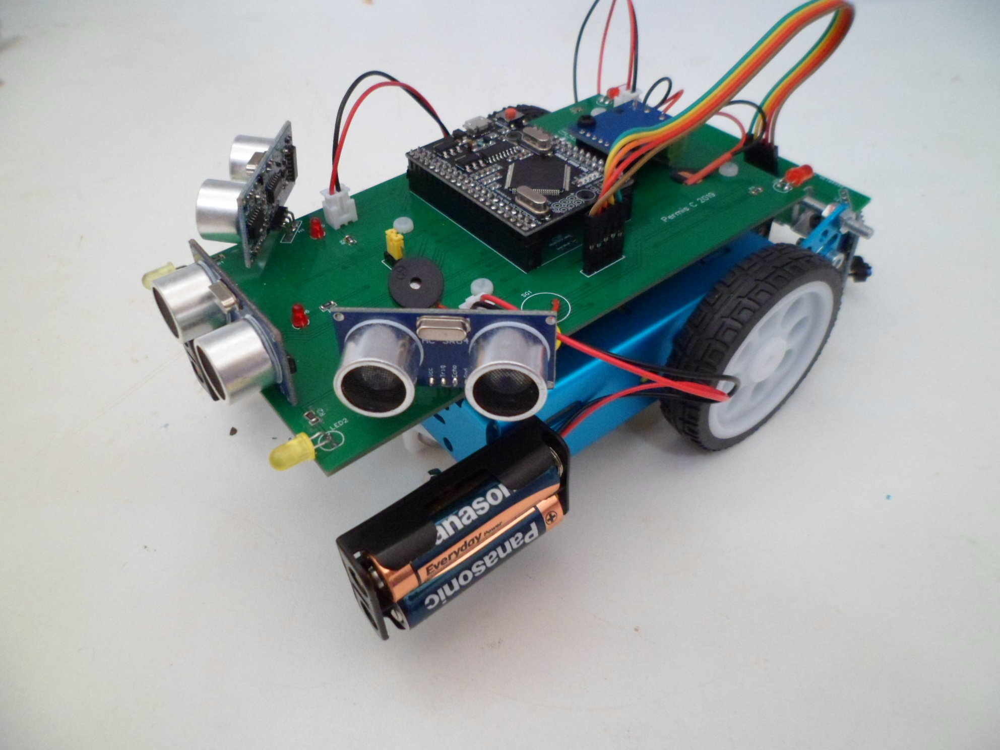

++++++++++++++++++++++++++++++++++++++++++++
Documentation du projet PermisC 2019
++++++++++++++++++++++++++++++++++++++++++++

.. image:: logoVoLAB_200x200.jpg

.. contents:: Table of Contents

.. section-numbering::

Présentation
=================
Il s'agit à la fois de décrire ici un atelier d'initiation à la programmation à destination
des collégiens et lycéens ansi que la conception d'un robot 2 roues conçu par le VoLAB spécialement
à cette occasion.

   
   Legende du petit robot Permis C 2019
   
Autre texte